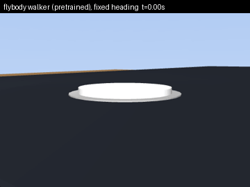
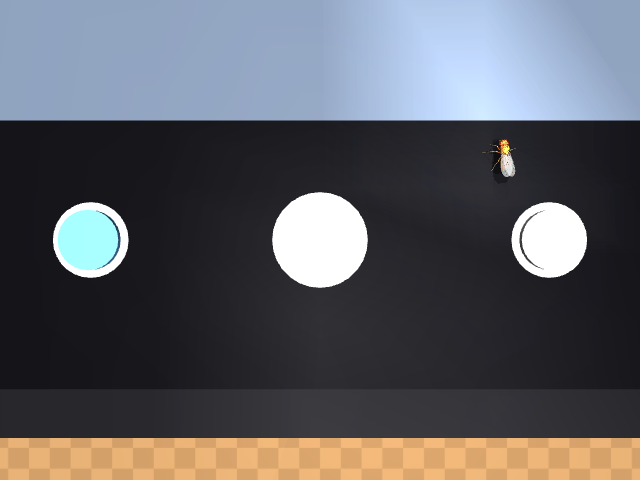

<h1 align="center">🪰📱 flyphone</h1>
<p align="center"><b>Teaching DeepMind's virtual fruit fly to take selfies with a phone.</b></p>
<p align="center">
  <a href="https://github.com/TuragaLab/flybody"></a>
  <a href="https://mujoco.org"></a>
  <a href="https://stable-baselines3.readthedocs.io"></a>
  
  <a href="LICENSE"></a>
</p>

<p align="center"><br>
<sub>Trained PPO policy (10M steps), deterministic rollout. 80 % of episodes end with a selfie.<br>
Right: the policy's activity projected onto the <a href="https://flywire.ai">FlyWire</a> fly-brain connectome (139k real neuron positions). See <a href="#brain-map">Brain map</a>.</sub></p>

`flybody` is the anatomically detailed *Drosophila* model built by Google DeepMind and HHMI Janelia
([Nature 2025](https://www.nature.com/articles/s41586-025-09029-4)). It can walk and fly.
This repo asks a sillier question: **can it learn to use a phone?**

The fly is dropped on the screen of a life‑size phone lying on a table. Somewhere on the screen there is a
physical shutter button on a spring. If the fly walks over and pushes it down, the phone's front camera fires
and you get a selfie. Everything is simulated in MuJoCo; the policy is trained from scratch with PPO on a laptop.

<p align="center">
  
  
  <br><sub>Left: third‑person view. Right: the actual photo rendered from the phone's selfie camera.</sub>
</p>

## Quickstart (2 minutes)

```bash
git clone https://github.com/Chere3/flyphone && cd flyphone
uv venv --python 3.11 .venv && source .venv/bin/activate     # or python -m venv
uv pip install -e ".[train]"                                  # or pip install -e ".[train]"

export MUJOCO_GL=glfw   # macOS; use egl on a headless Linux box
python scripts/demo_press.py     # validates the button → writes outputs/selfie_000.png
python scripts/train_ppo.py --steps 15_000_000 --envs 6 --run run1
python scripts/make_evolution.py --run run1   # curves + a video of the fly at every checkpoint
```

Runs on an Apple M4 laptop at ~750 environment steps/s with 6 worker processes (no GPU needed).

## How it works

| Piece | Where | What |
|---|---|---|
| Scene | `flyphone/arena.py` | Table, 7×15 cm phone, screen, shutter button on a slide joint + spring, selfie camera that always targets the button. `camera_app=True` draws a camera-app UI with two decoy buttons (gallery, flip camera) on the same spring mechanism. |
| Task | `flyphone/task.py` | `TakeSelfie`: spawns the fly 0.8–1.4 cm from the button with a random heading; adds `button_displacement` (egocentric vector to the button) and `button_state` to flybody's proprioceptive/vestibular observations. Stepping on a decoy "closes the app" (−10, episode over). `vision=True` swaps `button_displacement` for the two compound-eye cameras. |
| Reward | `flyphone/task.py` | Potential‑based progress toward the button (weighted by posture) + partial button depression + **+100** when the button is pressed **while upright**; small posture and angular‑velocity costs, −10 on a flip. Falling off the phone or flipping over ends the episode with discount 0. |
| Gym wrapper | `flyphone/gym_env.py` | Flattens observations to a 290‑vector, maps a [-1, 1] action box onto the 59 real actuator ranges (6 adhesion + 53 joints). With vision the observation is a Dict: `vec` + `eyes` (2 × 32 × 32, uint8). |
| Low-level walker | `flyphone/walker.py` | flybody's pretrained walking-imitation policy (DMPO, 741 → 512 × 4 → 59) ported to numpy from the TensorFlow snapshot, plus `SteerSelfieGym`: PPO outputs a heading command (speed, turn rate) and the walker turns it into leg movements. |
| Eyes | `flyphone/vision.py` | Small CNN feature extractor for the eye images (SB3 `MultiInputPolicy`). |
| Training | `scripts/train_ppo.py` | Stable‑Baselines3 PPO, `SubprocVecEnv` + `VecNormalize`, periodic evaluation that saves a video and the first selfie. Flags `--llc`, `--camera-app`, `--vision` select the v0.3 variants (they combine). |

Units are flybody's CGS units: the fly weighs ~1 mg (0.97 dyn) and the spring is tuned so that the fly's own
weight bottoms the button out. The button body uses gravity compensation so it rests at exactly zero without a fly on it.

## Results so far

**run1** (4.5M steps, no posture terms) learned to take selfies… by throwing itself at the button and landing on its back.
Every one of 12 rollouts of the 4.0M checkpoint ends with the fly flipped, most of them short of the button. Textbook reward hacking.

<p align="center"><br>
<sub>run1 @ 4.0M steps: lunges toward the button and ends up on its back. The selfies it did manage to take show it upside down on the button.</sub></p>

**run2** added an upright factor (presses only count on its feet, flipping is fatal). Fewer flips, still lunging.
**run3** weighted progress by posture and charged −10 for a flip: no more flipping, but the policy walks so
slowly it runs out of the 3 s episode one body length short. **run4** doubled the episode to 6 s and added a
small per-step cost. 20 fresh episodes per row:

| Checkpoint | Policy | success | flipped | mean time to photo |
|---|---|:---:|:---:|---:|
| v0.1 · 10M steps | deterministic | 80 % | 1/20 | 0.57 s |
| v0.1 · 10M steps | stochastic | 70 % | 4/20 | 1.14 s |
| **v0.2 · 15M steps** | deterministic | **100 %** | 0/20 | **0.13 s** |
| **v0.2 · 15M steps** | stochastic | 95 % | 1/20 | 0.16 s |

<p align="center"><br>
<sub>v0.2 (15M steps) in 8× slow motion: 0.13 s from spawn to selfie, upright the whole way.</sub></p>

<p align="center"></p>

Full details, curves, selfie mosaics and the bug list: **[docs/TRAINING_LOG.md](docs/TRAINING_LOG.md)**.

## v0.3: a real gait, a camera app, and eyes

The three open roadmap items are implemented and smoke-tested end to end (build → train → checkpoint → evaluate).
None of them has a long training run yet; see [docs/TRAINING_LOG.md](docs/TRAINING_LOG.md#v03) for what was measured.

**1. flybody's pretrained walker as a low-level controller (`--llc`).** The v0.2 gait is a lunge, not a walk.
flybody ships a walking-imitation policy, but only as a TensorFlow 2.8 + Sonnet snapshot that needs dm‑reverb
and Acme, none of which install on macOS/arm64. It turns out you don't need any of that to *run* the policy:
`scripts/export_walk_policy.py` reads the 14 weight tensors out of the SavedModel with any modern TensorFlow and
`flyphone/walker.py` re-implements the forward pass (LayerNorm‑MLP, 741 → 512 × 4 → 59) in ~20 lines of numpy.
The exported weights ship in `flyphone/assets/walk_policy.npz` (4.5 MB, Apache 2.0 like flybody). The policy
expects a 65-step reference trajectory; `SteerSelfieGym` synthesizes one on the fly from a 2‑D heading command
(forward speed, yaw rate) that the PPO policy chooses every 10 ms. On the phone, with a fixed "walk straight"
command, the walker keeps a natural hexapod gait and presses the shutter whenever it happens to be facing it:

<p align="center"><br>
<sub>No learning involved: the pretrained walker with a constant "2 cm/s straight ahead" command. PPO's job in <code>--llc</code> mode is only the steering.</sub></p>

```bash
python scripts/train_ppo.py --llc --steps 2_000_000 --envs 6 --run run5_llc      # 2-D action space
python scripts/eval_final.py runs/run5_llc/ppo_<N>_steps.zip 20 --llc
```

**2. Camera-app UI with decoy buttons (`--camera-app`).** The screen shows a camera app (top bar with flash /
timer / aspect icons, a viewfinder, a bottom bar) with three spring buttons: gallery, **shutter**, flip camera.
Only the shutter takes a photo; stepping on a decoy closes the app (−10, episode over, discount 0). Spawns are
rejected within leg reach of a decoy, and the wider ring (`--spawn 0.8 2.6`) puts a decoy between the fly and
the shutter in a good fraction of episodes. The observation grows by two (`button_state` is now one value per button).

<p align="center"></p>

```bash
python scripts/train_ppo.py --camera-app --spawn 0.8 2.6 --steps 15_000_000 --run run6_app
```

**3. Vision (`--vision`).** `button_displacement` is removed from the observation and the fly gets its two
compound-eye cameras (32 × 32 each, 150° field of view, grayscale). `flyphone/vision.py` adds a 3-layer CNN in
front of the PPO MLP. flybody renders the eyes every physics substep with shadows on; that cost 200 ms per step
on macOS/glfw. `TakeSelfie` re-registers the eye observables with shadows, reflections and skybox off, the fly's
own 800k‑vertex cosmetic meshes hidden, and a refresh every 4 control steps (125 Hz): ~4 ms per step instead.

```bash
python scripts/train_ppo.py --vision --steps 30_000_000 --run run7_eyes         # MultiInputPolicy
```

## Brain map

The simulated fly has no neurons: flybody is a body, and the only "brain" here is the PPO network
(290 → 256 → 256 → 59). To make its activity visible in the videos, `flyphone/brainviz.py` projects it onto
the real *Drosophila* brain: the positions and classes of 139 248 neurons from the FlyWire connectome
(Schlegel et al., *Nature* 2024, annotations CC‑BY 4.0), drawn as a point cloud in frontal view.

| Brain region (real neurons) | Lit by (policy signal) |
|---|---|
| sensory + ascending (19k) | the 290 normalized observations |
| central brain (32k) | the 512 hidden units (tanh) |
| descending + motor (1.4k) | the 59 action means |
| optic lobes (86k) | nothing — the v0.2 policy has no vision, so they stay dark (`--vision` policies are not wired into the map yet) |

Each network unit is assigned a fixed random subset of neurons in its region, so the same unit always lights
the same spots. It is a visualization of the artificial policy on real anatomy, **not** a simulation of the
fly's nervous system. `flyphone/viz.py` also has a plain per-layer grid view (`compose(..., mode="grid")`).

## Lessons learned (so you don't repeat them)

- **Reward what you mean.** Without an upright term the fly found that flipping onto the button is cheaper than walking. See the training log.

- **Don't recompile the MJCF every episode.** `composer.Environment(recompile_mjcf_every_episode=False)` turned a 1.1 s, memory‑leaking reset into 0.1 s.
- **On Apple Silicon, 6 worker processes beat 9.** More workers than performance cores just contend. Set `OMP_NUM_THREADS=1` per worker.
- **You don't need TensorFlow to use a TensorFlow policy.** flybody's walking policy needs TF 2.8 + dm‑reverb + Acme to *load*, none of which exist for macOS/arm64. Reading the 14 weight tensors out of the SavedModel and re-implementing the MLP in numpy took an afternoon and runs anywhere.
- **q and −q are the same rotation, but not to a neural network.** With a spawn yaw > π the root quaternion has w < 0 and the walker's reference quaternion came out as (−1, 0, 0, 0) instead of (1, 0, 0, 0). The walker fell over instantly. Canonicalize the sign.
- **The pretrained walker is fussy about physics.** It walks on the phone at the 0.4 ms timestep, but not with the `claw_friction = 1.0` this task sets (it trips and flips); `SteerSelfieGym` uses flybody's default friction.
- **Eye cameras are expensive for silly reasons.** Shadows (an 8192² shadow map of an 800k‑vertex fly) were 70 % of the render cost, and flybody refreshes the eyes every physics substep, i.e. 10 renders per control step. Turn shadows off, hide the fly's cosmetic meshes and refresh every few control steps: 200 ms → 4 ms per step.
- **Physics timestep 0.4 ms** (instead of flybody's 0.2 ms) is stable for this task and ~45 % faster.
- Three reward bugs caught before they ate a training run: the button sagging under its own cap, spawns that started with a leg already on the button, and a forgotten `Monitor` wrapper hiding episode stats.

## Roadmap

- [x] Publish run1 curves and the reward‑hacking post‑mortem
- [x] Publish final curves and the checkpoint‑by‑checkpoint evolution video (see the v0.1 release)
- [x] Use flybody's pretrained walker as a low‑level controller for a natural gait (`--llc`, runs on macOS too, see [v0.3](#v03-a-real-gait-a-camera-app-and-eyes))
- [x] Multiple buttons / a camera app UI on the screen (`--camera-app`)
- [x] Vision: let the fly find the button with its own compound‑eye cameras (`--vision`)
- [ ] Long training runs for the three v0.3 variants and their curves in the training log
- [ ] Light up the optic lobes of the brain map with the eye CNN's activations

Ideas and PRs welcome. If you get the fly to take a selfie faster, open an issue with the video 🙂

## Citation & credits

The body model, physics and task base classes are from **flybody** (Apache 2.0):

> Vaxenburg et al., *Whole-body physics simulation of fruit fly locomotion*, Nature 643, 1312–1320 (2025).

Neuron positions and classes in the brain map are from the **FlyWire** connectome annotations
([flyconnectome/flywire_annotations](https://github.com/flyconnectome/flywire_annotations), CC‑BY 4.0):

> Schlegel et al., *Whole-brain annotation and multi-connectome cell typing of Drosophila*, Nature 634, 139–152 (2024).
> Dorkenwald et al., *Neuronal wiring diagram of an adult brain*, Nature 634, 124–138 (2024).

This repo is licensed under Apache 2.0.
