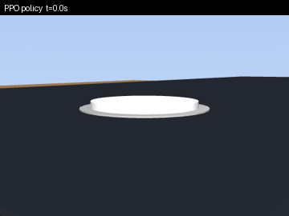
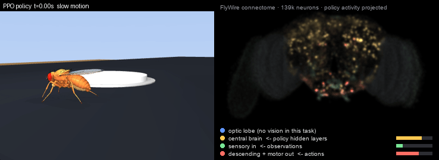
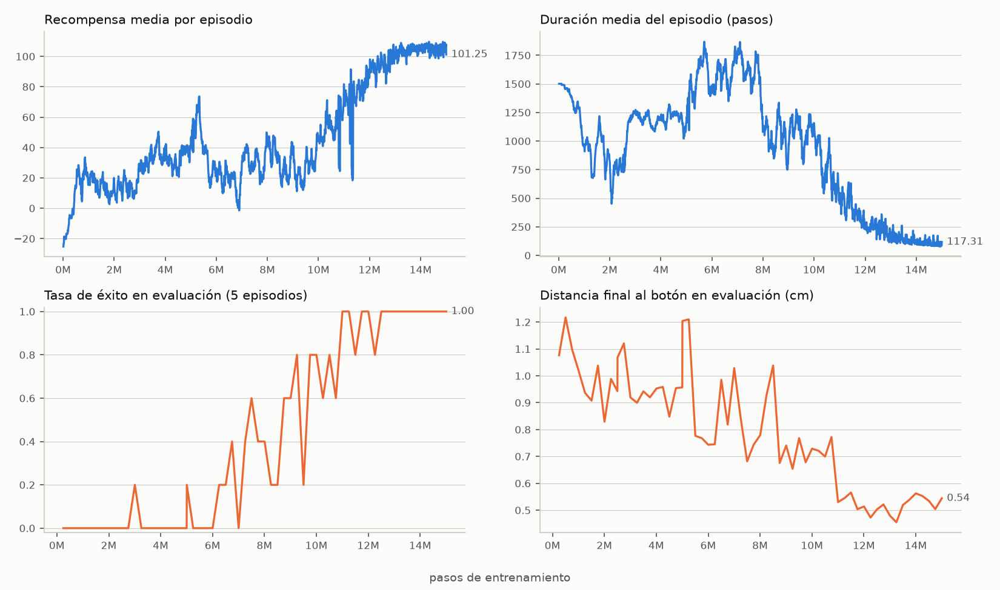

<h1 align="center">🪰📱 flyphone</h1>
<p align="center"><b>Teaching DeepMind's virtual fruit fly to take selfies with a phone.</b></p>
<p align="center">
  <a href="https://github.com/TuragaLab/flybody"></a>
  <a href="https://mujoco.org"></a>
  <a href="https://stable-baselines3.readthedocs.io"></a>
  
  <a href="LICENSE"></a>
</p>

<p align="center"><br>
<sub>Trained PPO policy (10M steps), deterministic rollout. 80 % of episodes end with a selfie.<br>
Right: the policy's activity projected onto the <a href="https://flywire.ai">FlyWire</a> fly-brain connectome (139k real neuron positions). See <a href="#brain-map">Brain map</a>.</sub></p>

`flybody` is the anatomically detailed *Drosophila* model built by Google DeepMind and HHMI Janelia
([Nature 2025](https://www.nature.com/articles/s41586-025-09029-4)). It can walk and fly.
This repo asks a sillier question: **can it learn to use a phone?**

The fly is dropped on the screen of a life‑size phone lying on a table. Somewhere on the screen there is a
physical shutter button on a spring. If the fly walks over and pushes it down, the phone's front camera fires
and you get a selfie. Everything is simulated in MuJoCo; the policy is trained from scratch with PPO on a laptop.

<p align="center">
  
  
  <br><sub>Left: third‑person view. Right: the actual photo rendered from the phone's selfie camera.</sub>
</p>

## Quickstart (2 minutes)

```bash
git clone https://github.com/Chere3/flyphone && cd flyphone
uv venv --python 3.11 .venv && source .venv/bin/activate     # or python -m venv
uv pip install -e ".[train]"                                  # or pip install -e ".[train]"

export MUJOCO_GL=glfw   # macOS; use egl on a headless Linux box
python scripts/demo_press.py     # validates the button → writes outputs/selfie_000.png
python scripts/train_ppo.py --steps 15_000_000 --envs 6 --run run1
python scripts/make_evolution.py --run run1   # curves + a video of the fly at every checkpoint
```

Runs on an Apple M4 laptop at ~750 environment steps/s with 6 worker processes (no GPU needed).

## How it works

| Piece | Where | What |
|---|---|---|
| Scene | `flyphone/arena.py` | Table, 7×15 cm phone, screen, shutter button on a slide joint + spring, selfie camera that always targets the button. |
| Task | `flyphone/task.py` | `TakeSelfie`: spawns the fly 0.8–1.4 cm from the button with a random heading; adds `button_displacement` (egocentric vector to the button) and `button_state` to flybody's proprioceptive/vestibular observations. |
| Reward | `flyphone/task.py` | Potential‑based progress toward the button (weighted by posture) + partial button depression + **+100** when the button is pressed **while upright**; small posture and angular‑velocity costs, −10 on a flip. Falling off the phone or flipping over ends the episode with discount 0. |
| Gym wrapper | `flyphone/gym_env.py` | Flattens observations to a 290‑vector, maps a [-1, 1] action box onto the 59 real actuator ranges (6 adhesion + 53 joints). |
| Training | `scripts/train_ppo.py` | Stable‑Baselines3 PPO, `SubprocVecEnv` + `VecNormalize`, periodic evaluation that saves a video and the first selfie. |

Units are flybody's CGS units: the fly weighs ~1 mg (0.97 dyn) and the spring is tuned so that the fly's own
weight bottoms the button out. The button body uses gravity compensation so it rests at exactly zero without a fly on it.

## Results so far

**run1** (4.5M steps, no posture terms) learned to take selfies… by throwing itself at the button and landing on its back.
Every one of 12 rollouts of the 4.0M checkpoint ends with the fly flipped, most of them short of the button. Textbook reward hacking.

<p align="center"><br>
<sub>run1 @ 4.0M steps: lunges toward the button and ends up on its back. The selfies it did manage to take show it upside down on the button.</sub></p>

**run2** added an upright factor (presses only count on its feet, flipping is fatal). Fewer flips, still lunging.
**run3** weighted progress by posture and charged −10 for a flip: no more flipping, but the policy walks so
slowly it runs out of the 3 s episode one body length short. **run4** doubled the episode to 6 s and added a
small per-step cost. 20 fresh episodes per row:

| Checkpoint | Policy | success | flipped | mean time to photo |
|---|---|:---:|:---:|---:|
| v0.1 · 10M steps | deterministic | 80 % | 1/20 | 0.57 s |
| v0.1 · 10M steps | stochastic | 70 % | 4/20 | 1.14 s |
| **v0.2 · 15M steps** | deterministic | **100 %** | 0/20 | **0.13 s** |
| **v0.2 · 15M steps** | stochastic | 95 % | 1/20 | 0.16 s |

<p align="center"><br>
<sub>v0.2 (15M steps) in 8× slow motion: 0.13 s from spawn to selfie, upright the whole way.</sub></p>

<p align="center"></p>

Full details, curves, selfie mosaics and the bug list: **[docs/TRAINING_LOG.md](docs/TRAINING_LOG.md)**.

## Brain map

The simulated fly has no neurons: flybody is a body, and the only "brain" here is the PPO network
(290 → 256 → 256 → 59). To make its activity visible in the videos, `flyphone/brainviz.py` projects it onto
the real *Drosophila* brain: the positions and classes of 139 248 neurons from the FlyWire connectome
(Schlegel et al., *Nature* 2024, annotations CC‑BY 4.0), drawn as a point cloud in frontal view.

| Brain region (real neurons) | Lit by (policy signal) |
|---|---|
| sensory + ascending (19k) | the 290 normalized observations |
| central brain (32k) | the 512 hidden units (tanh) |
| descending + motor (1.4k) | the 59 action means |
| optic lobes (86k) | nothing — this task has no vision, so they stay dark |

Each network unit is assigned a fixed random subset of neurons in its region, so the same unit always lights
the same spots. It is a visualization of the artificial policy on real anatomy, **not** a simulation of the
fly's nervous system. `flyphone/viz.py` also has a plain per-layer grid view (`compose(..., mode="grid")`).

## Lessons learned (so you don't repeat them)

- **Reward what you mean.** Without an upright term the fly found that flipping onto the button is cheaper than walking. See the training log.

- **Don't recompile the MJCF every episode.** `composer.Environment(recompile_mjcf_every_episode=False)` turned a 1.1 s, memory‑leaking reset into 0.1 s.
- **On Apple Silicon, 6 worker processes beat 9.** More workers than performance cores just contend. Set `OMP_NUM_THREADS=1` per worker.
- **flybody's pretrained walking policies need TensorFlow 2.8 + dm‑reverb**, which have no macOS/arm64 wheels. That's why this trains from scratch.
- **Physics timestep 0.4 ms** (instead of flybody's 0.2 ms) is stable for this task and ~45 % faster.
- Three reward bugs caught before they ate a training run: the button sagging under its own cap, spawns that started with a leg already on the button, and a forgotten `Monitor` wrapper hiding episode stats.

## Roadmap

- [x] Publish run1 curves and the reward‑hacking post‑mortem
- [x] Publish final curves and the checkpoint‑by‑checkpoint evolution video (see the v0.1 release)
- [ ] Use flybody's pretrained walker as a low‑level controller (Linux/Colab) for a natural gait
- [ ] Multiple buttons / a camera app UI on the screen
- [ ] Vision: let the fly find the button with its own compound‑eye cameras

Ideas and PRs welcome. If you get the fly to take a selfie faster, open an issue with the video 🙂

## Citation & credits

The body model, physics and task base classes are from **flybody** (Apache 2.0):

> Vaxenburg et al., *Whole-body physics simulation of fruit fly locomotion*, Nature 643, 1312–1320 (2025).

Neuron positions and classes in the brain map are from the **FlyWire** connectome annotations
([flyconnectome/flywire_annotations](https://github.com/flyconnectome/flywire_annotations), CC‑BY 4.0):

> Schlegel et al., *Whole-brain annotation and multi-connectome cell typing of Drosophila*, Nature 634, 139–152 (2024).
> Dorkenwald et al., *Neuronal wiring diagram of an adult brain*, Nature 634, 124–138 (2024).

This repo is licensed under Apache 2.0.
