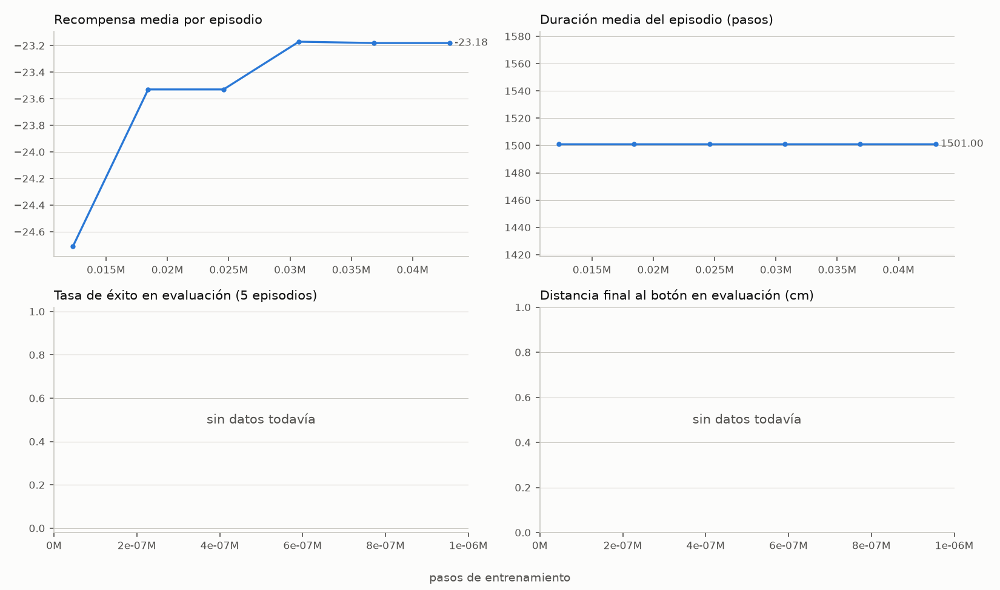
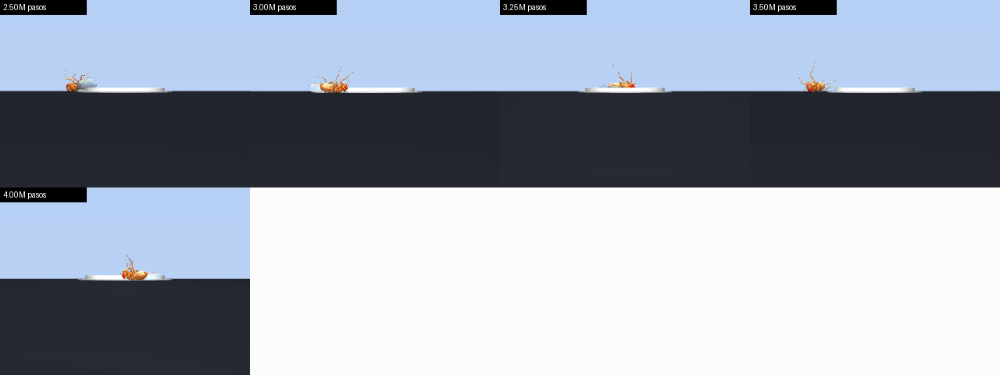

# Training log

Everything here was run on a MacBook Air M4 (10 cores, 16 GB), CPU only, 6 worker processes,
~700–850 environment steps/s. Physics timestep 0.4 ms, control timestep 2 ms, 3 s episodes.

## run1 — reward without posture terms (stopped at 4.5M / 15M steps)

**Reward:** `10 · Δdistance_to_button + 5 · button_depth + 100 · pressed`.
Episode ends with discount 0 if the fly leaves the phone.

| Steps | Eval success (5 det. episodes) | Mean final distance |
|---:|:---:|---:|
| 0.25M–2.25M | 0/5 | 0.96–1.38 cm |
| 2.5M | 1/5 | 1.22 cm |
| 3.0M | **2/5** | 0.82 cm |
| 3.25M–3.5M | 1/5 | 0.88–1.01 cm |
| 4.0M | **2/5** | **0.77 cm** |
| 4.25M–4.5M | 0/5 | 1.39–1.51 cm |

Training reward climbed from 0 to a noisy 15–40 (the +100 bonus means the fly was pressing the button in
roughly 15–35 % of training episodes) and mean episode length fell from 1500 to ~1330 steps.

**What it actually learned:** not walking. Look at the selfies the phone took:

The fly discovered that flipping itself onto the button also depresses the spring. By 3.25M steps every
selfie shows it upside down, legs in the air. Rolling out the 4.0M checkpoint 12 times: **12/12 episodes end
with the fly flipped** (`world_zaxis[2] = -1`).

 
4.0M checkpoint, stochastic rollout: the closest of the 12 flipped episodes. It lunges, flips, and does not reach the cap.

Nothing in the reward said "stay on your feet", so the cheapest strategy won. Classic reward hacking.

## run2 — posture-aware reward (running)

Changes in `flyphone/task.py`:

- **Upright factor** `u = world_zaxis[2]` in the fly's frame (1 = upright, −1 = flipped).
- Button depression and the +100 bonus **only count while `u > 0.5`**. A flipped press takes no photo.
- Per-step posture penalty `0.05 · (u − 1)` and angular-velocity cost `5e‑4 · |gyro|`.
- **Flipping is fatal:** `u < 0.1` ends the episode with discount 0, like falling off the phone.

Sanity checks before launching: a fly standing still scores ≈ −0.004/step (tiny drift), a fly dropped upside
down on the button scores no photo and terminates, a fly dropped upright on the button still takes the photo.

Results will be added here as evaluations come in.

## Bugs that were caught before they burned a run

1. **Button sagging under its own cap.** The cap's mass compressed the spring 26 % with nobody on it, paying
   1.3 reward/step for free. Fixed with `gravcomp="1"` on the button body.
2. **Trivial spawns.** Minimum spawn radius 0.4 cm equals the button radius; the fly sometimes started with a
   leg on the cap and "succeeded" at t = 0.04 s. Minimum is now 0.8 cm (button radius + leg span).
3. **Missing `Monitor` wrapper.** Without it Stable‑Baselines3 logs no `rollout/ep_rew_mean`, so TensorBoard
   looked empty.
4. **MJCF recompiled every reset** (1.1 s and +11 MB per episode). `recompile_mjcf_every_episode=False`.
5. **Too many workers.** 9 processes on a 4P+6E‑core M4 gave 490 fps; 6 processes with `OMP_NUM_THREADS=1`
   give ~800.
