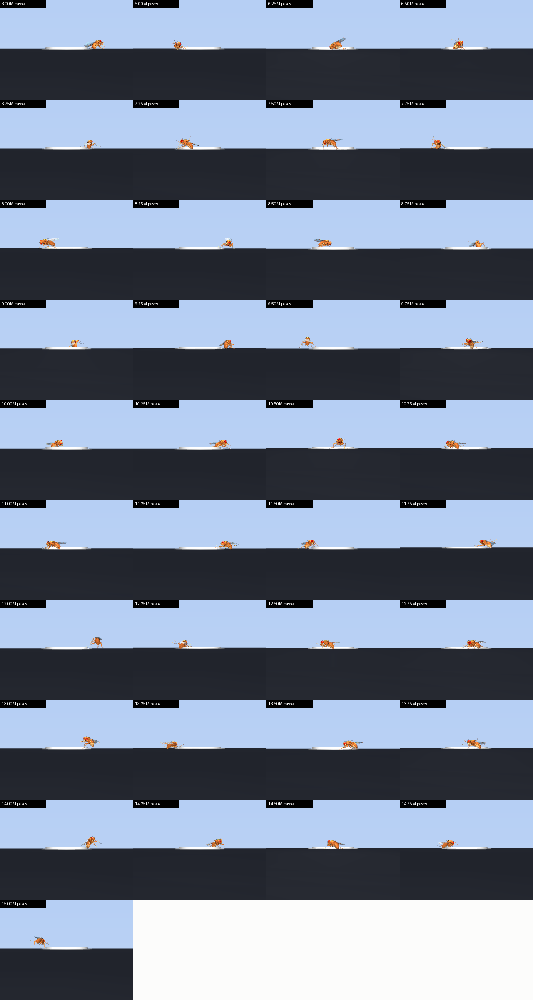

# Training log

Everything here was run on a MacBook Air M4 (10 cores, 16 GB), CPU only, 6 worker processes,
~700–850 environment steps/s. Physics timestep 0.4 ms, control timestep 2 ms, 3 s episodes.

## run1 — reward without posture terms (stopped at 4.5M / 15M steps)

**Reward:** `10 · Δdistance_to_button + 5 · button_depth + 100 · pressed`.
Episode ends with discount 0 if the fly leaves the phone.

| Steps | Eval success (5 det. episodes) | Mean final distance |
|---:|:---:|---:|
| 0.25M–2.25M | 0/5 | 0.96–1.38 cm |
| 2.5M | 1/5 | 1.22 cm |
| 3.0M | **2/5** | 0.82 cm |
| 3.25M–3.5M | 1/5 | 0.88–1.01 cm |
| 4.0M | **2/5** | **0.77 cm** |
| 4.25M–4.5M | 0/5 | 1.39–1.51 cm |

Training reward climbed from 0 to a noisy 15–40 (the +100 bonus means the fly was pressing the button in
roughly 15–35 % of training episodes) and mean episode length fell from 1500 to ~1330 steps.

**What it actually learned:** not walking. Look at the selfies the phone took:

The fly discovered that flipping itself onto the button also depresses the spring. By 3.25M steps every
selfie shows it upside down, legs in the air. Rolling out the 4.0M checkpoint 12 times: **12/12 episodes end
with the fly flipped** (`world_zaxis[2] = -1`).

 
4.0M checkpoint, stochastic rollout: the closest of the 12 flipped episodes. It lunges, flips, and does not reach the cap.

Nothing in the reward said "stay on your feet", so the cheapest strategy won. Classic reward hacking.

## run2 — posture-aware reward, v1 (stopped at 2.5M steps)

Changes in `flyphone/task.py`:

- **Upright factor** `u = world_zaxis[2]` in the fly's frame (1 = upright, −1 = flipped).
- Button depression and the +100 bonus **only count while `u > 0.5`**. A flipped press takes no photo.
- Per-step posture penalty `0.05 · (u − 1)` and angular-velocity cost `5e‑4 · |gyro|`.
- **Flipping is fatal:** `u < 0.1` ends the episode with discount 0, like falling off the phone.

Sanity checks before launching: a fly standing still scores ≈ −0.004/step (tiny drift), a fly dropped upside
down on the button scores no photo and terminates, a fly dropped upright on the button still takes the photo.

**Result:** better, not fixed. Deterministic evaluation stayed at 0/5 through 2.5M steps while the mean final
distance drifted down (1.08 → 0.83–0.99 cm). Rolling out the 2.5M checkpoint 8 times each way:

| Mode | photo | flipped (fatal) | timeout | mean length |
|---|:---:|:---:|:---:|---:|
| deterministic | 1 | 4 | 3 | 765 |
| stochastic | 1 | 5 | 2 | 741 |

The fly still lunges. It collects the progress reward (`10 · Δdistance`) on the way in, then tips over; losing
the future (discount 0) is not enough of a deterrent because the progress was already banked.

## run3 — posture-aware reward, v2 (resumed from run2 @ 2.5M, stopped at 5.0M)

- Progress term is weighted by posture: `10 · Δdistance · max(u, 0)`.
- Flip threshold raised to `u < 0.3` and an explicit **−10 penalty** on the flip step.
- Resumed from the run2 2.5M checkpoint (policy + VecNormalize stats) instead of restarting.

**Result:** flipping is gone (3.5M checkpoint, 8 deterministic rollouts: 0 flipped, all timeouts; run2 had 4/8
flipped). Training reward rose to 22–49, i.e. the *stochastic* policy presses the button in roughly a quarter
to almost half of training episodes. But deterministic evaluation stayed at 0–1/5 through 5.0M steps.

Tracing the deterministic policy showed why: it walks, upright, at ~0.15 cm/s. From 0.9–1.4 cm away it simply
runs out of the 3 s episode about one body length short of the cap (final distances 0.85–1.08 cm). With
exploration noise it occasionally covers the gap; the mean action does not.

## run4 — longer episodes, time cost (resumed from run3 @ 5.0M, finished at 15.0M; v0.1 = 10M checkpoint, v0.2 = 15M)

- Episode length 3 s → **6 s** (1500 → 3000 control steps).
- **−0.01 per step** so arriving earlier is worth more than dawdling (max −30 over an episode vs +100 for the photo).
- Everything else unchanged; resumed from the run3 5.0M checkpoint.

**Result: it works.** Deterministic evaluation (5 episodes every 250k steps):

| Steps | 5.0 | 5.25 | 5.5 | 5.75 | 6.0 | 6.25 | 6.5 | 6.75 | 7.0 | 7.25 | 7.5 | 7.75 | 8.0 | 8.25 | 8.5 | 8.75 | 9.0 | 9.25 | 9.5 | 9.75 | 10.0 |
|---|---|---|---|---|---|---|---|---|---|---|---|---|---|---|---|---|---|---|---|---|---|
| Photos /5 | 1 | 0 | 0 | 0 | 0 | 1 | 1 | 2 | 0 | 2 | **3** | 2 | 2 | 1 | 1 | **3** | **3** | **4** | 1 | **4** | **4** |

| Steps | 10.25 | 10.5 | 10.75 | 11.0 | 11.25 | 11.5 | 11.75 | 12.0 | 12.25 | 12.5 | 12.75 | 13.0 | 13.25 | 13.5 | 13.75 | 14.0 | 14.25 | 14.5 | 14.75 | 15.0 |
|---|---|---|---|---|---|---|---|---|---|---|---|---|---|---|---|---|---|---|---|---|
| Photos /5 | 3 | 4 | 3 | **5** | **5** | 4 | **5** | **5** | 4 | **5** | **5** | **5** | **5** | **5** | **5** | **5** | **5** | **5** | **5** | **5** |

v0.1 checkpoint (10.0M steps), 20 fresh episodes each, 6 s limit, spawn 0.8–1.4 cm from the button:

| Policy | photo | timeout | flipped | success | mean time to photo |
|---|:---:|:---:|:---:|:---:|---:|
| deterministic | 16 | 3 | 1 | **80 %** | 0.57 s |
| stochastic | 14 | 2 | 4 | 70 % | 1.14 s |

v0.2 checkpoint (15.0M steps), same protocol:

| Policy | photo | timeout | flipped | success | mean time to photo |
|---|:---:|:---:|:---:|:---:|---:|
| deterministic | 20 | 0 | 0 | **100 %** | 0.13 s |
| stochastic | 19 | 0 | 1 | 95 % | 0.16 s |

From 10M to 15M the policy went from "usually" to "always", and from 0.57 s to 0.13 s: it now covers the
0.8–1.4 cm in a single fast lunge, upright, and lands a front leg on the cap. Twelve perfect 5/5 evaluations
in a row from 12.5M onward.

The selfies are now taken standing on the button. The gait is not a fly's gait: it is a fast, low lunge-and-step
that keeps the body upright, which is what a from-scratch PPO policy on 59 actuators finds first. A natural
gait would need flybody's imitation-trained walker as a low-level controller (issue #2).

The full checkpoint-by-checkpoint video (with the FlyWire brain map of policy activity alongside) (same start state, one episode per checkpoint from 0.5M to 10M
steps) is attached to the [v0.1 release](https://github.com/Chere3/flyphone/releases/tag/v0.1).

## v0.3 — walker, camera app, eyes (implemented, no long runs yet) 

The three roadmap items landed as opt-in variants of the same task (`--llc`, `--camera-app`, `--vision`; they
combine). Each was smoke-tested end to end: 4 096 training steps on 2 workers with the periodic evaluation,
checkpoint + VecNormalize saved, `eval_final.py` on the result. The default task and the v0.2 checkpoint are
untouched (observation still 290, `eval_final.py runs/run4/ppo_14999940_steps.zip` still 100 %).

### Pretrained walker as low-level controller (`flyphone/walker.py`)

flybody's walking policy (`trained-fly-policies.zip` on figshare, `policies/walking`) is a Sonnet DMPO network:
`batch_concat` of 12 observables sorted by name (741 inputs) → Linear 512 → LayerNorm → tanh → 3 × (Linear 512
→ ELU) → Linear 59 (Gaussian mean; the second head is the scale and is unused). The 14 tensors were read from
the SavedModel's variables checkpoint with TF 2.21 (`scripts/export_walk_policy.py`) and the forward pass
re-implemented in numpy. Check: in flybody's own `walk_imitation()` inference environment (0.2 ms physics), the
numpy policy tracks the synthetic 2 cm/s straight trajectory with 0.02–0.05 cm error and covers 0.97 cm in
0.47 s (expected 0.94 cm).

`SteerSelfieGym` feeds it a reference trajectory synthesized every control step from the fly's current pose and
a (speed, yaw rate) command: `ref_displacement` (65 × 3, egocentric) and `ref_root_quat` (65 × 4). Two things
broke it on the phone before it worked:

| Setting | Result with a constant "2 cm/s straight" command, seed 3 |
|---|---|
| as TakeSelfie is (0.4 ms physics, `claw_friction = 1.0`) | flips in 0.07 s |
| 0.2 ms physics | walks, presses the button at 0.36 s |
| 0.4 ms physics, flybody's default claw friction | walks, presses the button at 0.33 s |
| + reference quaternion sign not canonicalized, spawn yaw > π | flips in 0.05–0.15 s (delta quaternion came out as (−1, 0, 0, 0)) |

With flybody's friction and the sign fix, 30 fresh spawns (seeds 100–129) with the fixed straight command: 9 press
the shutter (0.13–2.0 s), the rest walk past it or off the phone edge, none flip on the screen. The gait is a
proper alternating tripod at ~2–2.6 cm/s (`docs/walker_gait.gif`). PPO in `--llc` mode only learns the 2‑D
steering, held for 5 control steps (10 ms).

### Camera-app UI with decoys (`PhoneArena(camera_app=True)`)

Bottom bar with gallery (x = −2.3), shutter (0) and flip-camera (+2.3) buttons, all on the same slide joint +
spring + touch sensor. Decoy caps are 0.3 cm (shutter 0.4). Pressing a decoy sets `wrong_button`, ends the episode
with discount 0 and −10. Spawn rejection keeps every start ≥ 0.4 cm (leg reach) from a decoy edge and ≥ 0.3 cm
inside the screen; over 200 draws with `--spawn 0.8 2.6` the closest start was 0.44 cm from a decoy edge.
Sanity: a fly dropped on the flip button → `wrong_button` at step 3, reward −10, discount 0; dropped on the
shutter → photo at step 3, reward +103.9. Throughput is unchanged (138 vs 133 steps/s single process).

### Vision (`TakeSelfie(vision=True)`)

flybody's eye observables are `MJCFCamera(32 × 32)` with `update_interval = 1`, which composer interprets as
*every physics substep*: 5 substeps × 2 eyes = 10 renders per control step, with shadows. Measured on the M4
with glfw, per 32 × 32 render:

| Render | ms |
|---|---:|
| flybody default (shadows, reflections, skybox, full fly meshes) | 83 |
| shadows off | 25 |
| shadows + reflections + skybox off | 16 |
| + fly's cosmetic meshes hidden (geom group 1, 817k vertices) | 8 |
| nothing visible (fixed cost of a glfw offscreen render) | 6 |

`TakeSelfie._add_fast_eyes` re-registers both eyes with those flags and `update_interval` = 4 control steps
(125 Hz). Single-process throughput: 5 steps/s with flybody's eyes → 194 steps/s with the fast ones (base task:
133 in the same conditions). The observation becomes a Dict (`vec` 287 + `eyes` 2 × 32 × 32 uint8) and PPO uses
`MultiInputPolicy` with the CNN in `flyphone/vision.py` (3 × 3 convs, stride 2, → 32 features); `VecNormalize`
only normalizes `vec`. The button shows up as a bright blob against the dark screen in one eye or the other from
the spawn ring; the sky is black (skybox off).

### Smoke runs (4 096 steps, 2 workers, not results)

| Run | Variant | Trains | Periodic eval (video + selfie) | `eval_final.py` |
|---|---|:---:|:---:|:---:|
| `_smoke_llc` | `--llc` | ✓ | ✓ | ✓ |
| `_smoke_camapp` | `--camera-app --spawn 0.8 2.6` | ✓ | ✓ | ✓ |
| `_smoke_vision3` | `--vision` | ✓ | ✓ | ✓ |

## Bugs that were caught before they burned a run

1. **Button sagging under its own cap.** The cap's mass compressed the spring 26 % with nobody on it, paying
   1.3 reward/step for free. Fixed with `gravcomp="1"` on the button body.
2. **Trivial spawns.** Minimum spawn radius 0.4 cm equals the button radius; the fly sometimes started with a
   leg on the cap and "succeeded" at t = 0.04 s. Minimum is now 0.8 cm (button radius + leg span).
3. **Missing `Monitor` wrapper.** Without it Stable‑Baselines3 logs no `rollout/ep_rew_mean`, so TensorBoard
   looked empty.
4. **MJCF recompiled every reset** (1.1 s and +11 MB per episode). `recompile_mjcf_every_episode=False`.
5. **Too many workers.** 9 processes on a 4P+6E‑core M4 gave 490 fps; 6 processes with `OMP_NUM_THREADS=1`
   give ~800.
6. **OpenBLAS threads in the evaluation scripts** (v0.3). The numpy walker does a handful of 512 × 512 gemvs per
   step; with OpenBLAS's default thread count each one fans out to spinning threads (300 % CPU, ~10× slower).
   `eval_final.py` and `make_walker_gif.py` now pin one BLAS thread before importing numpy, like `train_ppo.py`.
7. **Reference quaternion sign** (v0.3). q and −q are the same rotation but different network inputs; with
   spawn yaw > π the walker's delta quaternion flipped sign and the fly fell over instantly.
